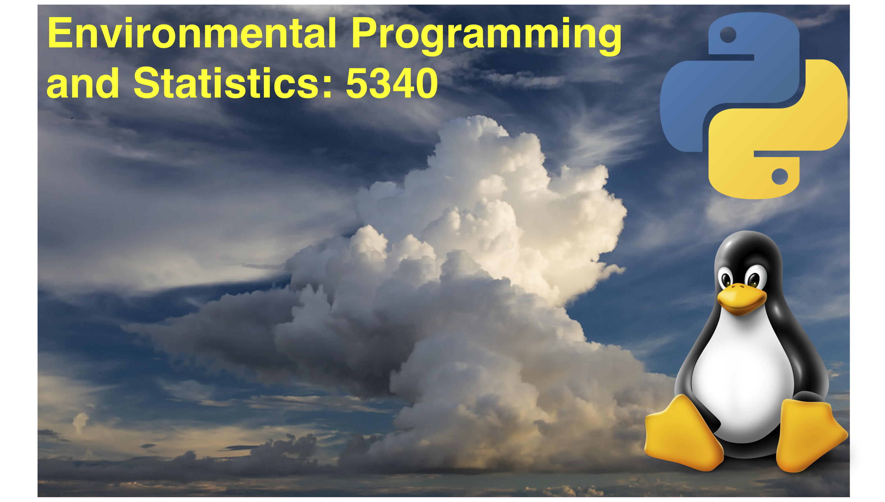
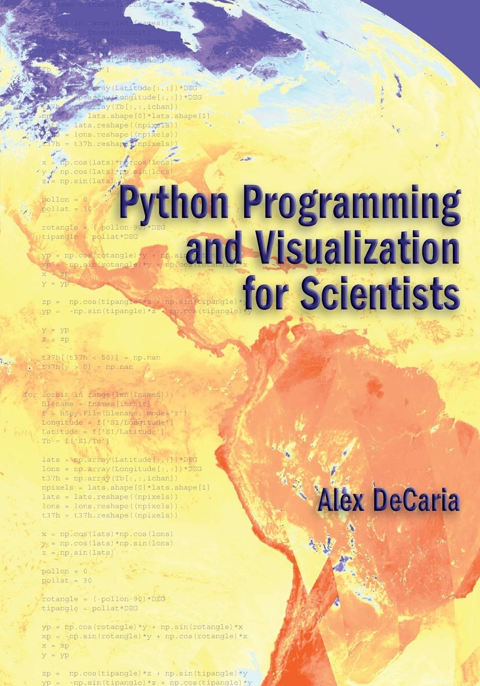
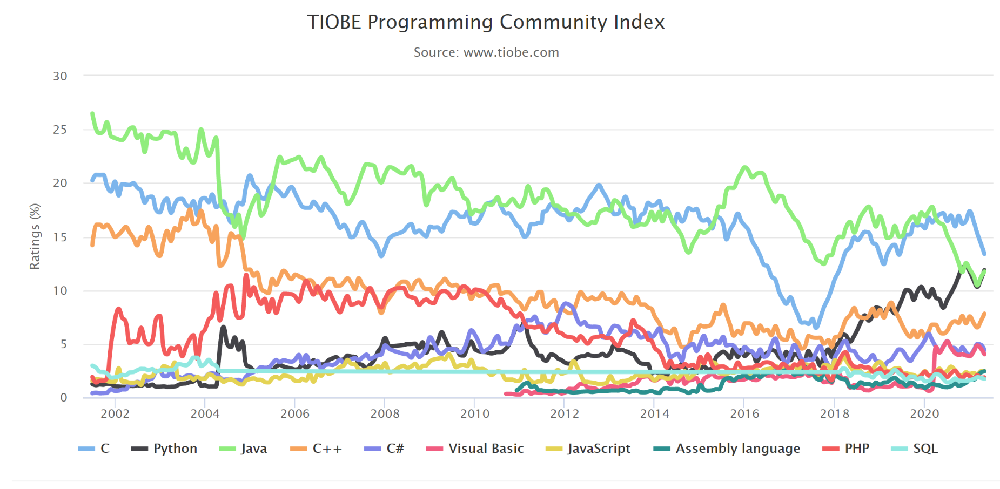
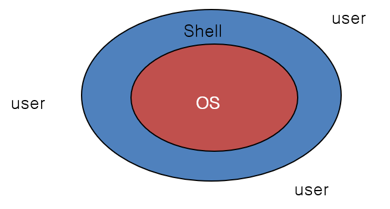
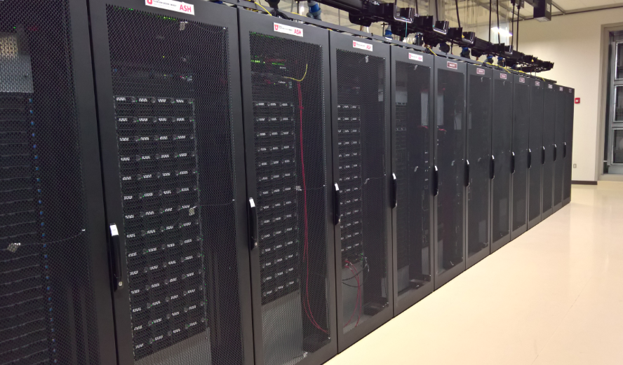
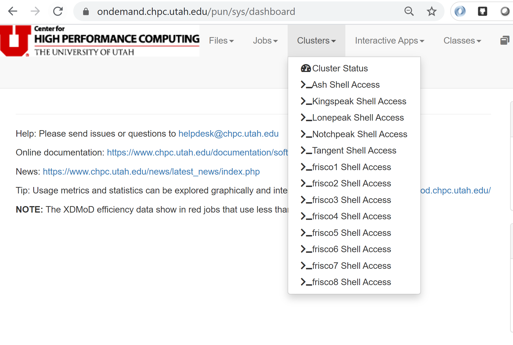
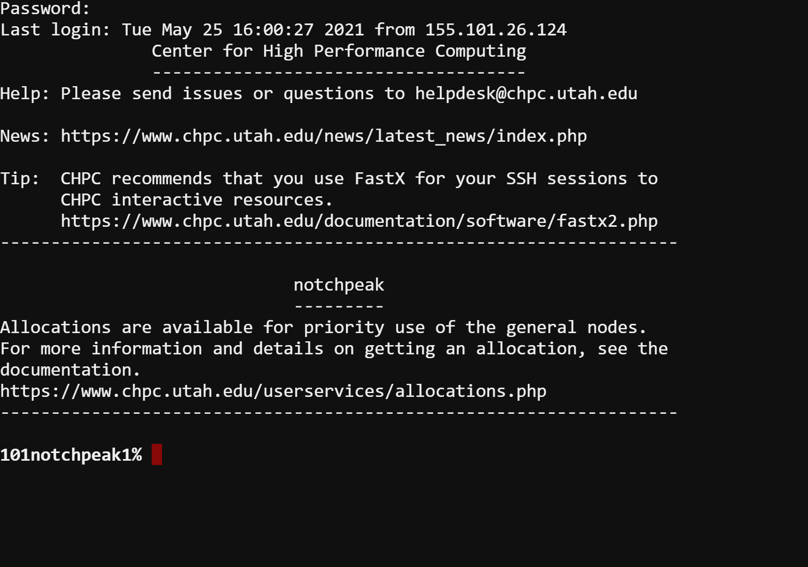
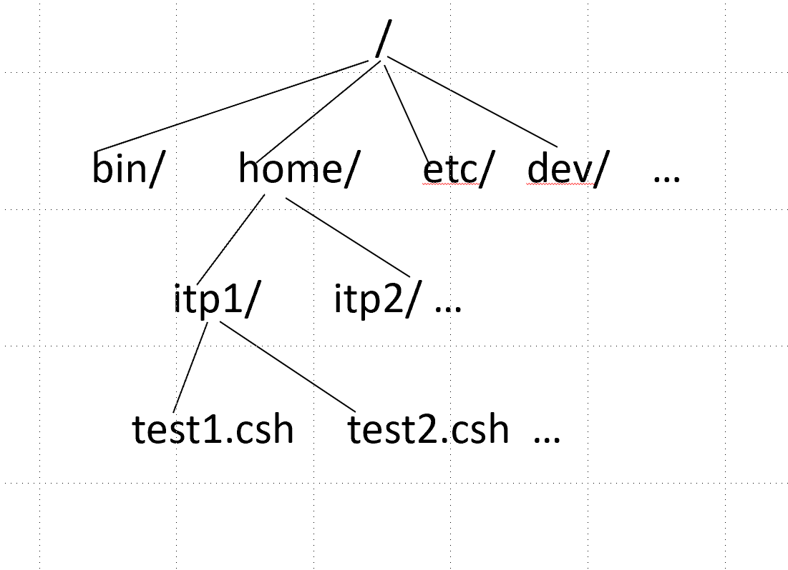
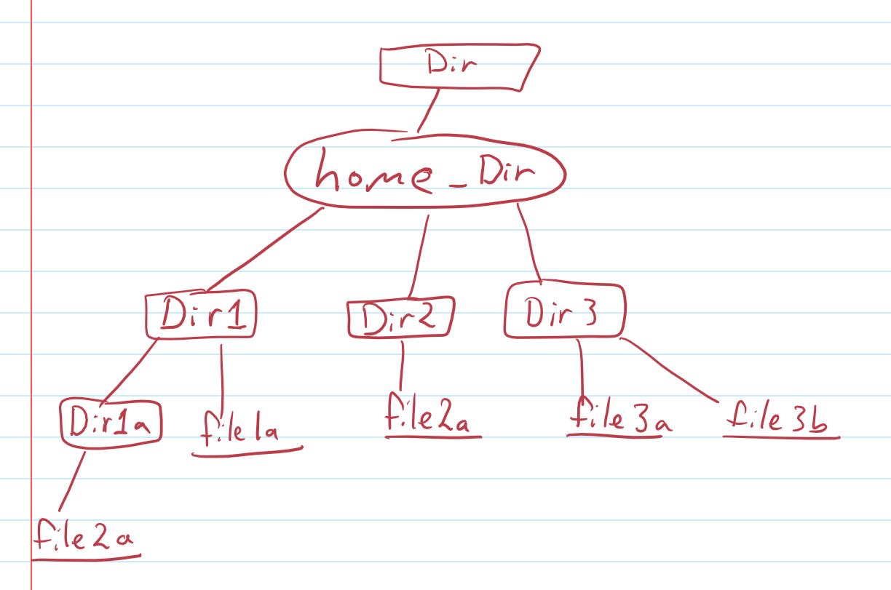

**ATMOS 5340: Environmental Programming and Statistics**  
**John Horel 

# Welcome to ATMOS 5340: Environmental Programming and Statistics

It likely will be confusing initially that this class uses multiple access points:
1. Canvas: https://utah.instructure.com/courses/727035 
1. ### [Teams](https://teams.microsoft.com/l/team/19%3a78c4837f991c463998b580932366bbe8%40thread.tacv2/conversations?groupId=919e742b-e77d-484e-b6bd-52c57e0395df&tenantId=5217e0e7-539d-4563-b1bf-7c6dcf074f91) 
1. GitHub: https://github.com/johnhorel/atmos_5340_2021 
4. OpenOnDemand: https://ondemand.chpc.utah.edu/ 

> # Today’s Objectives
1. Review nuts and bolts of the class 
>     - Canvas: https://utah.instructure.com/courses/727035/
2. Notes. Chapter 1. What this course is about
1. Introduce CHPC computing resources

> 

|Instructor|Email|Phone|Office Hours|Office Location|
|-|-|-|-|-|
|John Horel|john.horel@utah.edu|Office: (801) 581-7091 Cell: (801) 870-9450|By appointment|INSCC 483|

Emails to arrange for an appointment or to discuss a class-related topic should include ATMOS 5340 in the subject line.  **Much better to communicate via Teams!**

# Text Book
- **Recommended**: _Python Programming and Visualization for Scientists_. A. DeCaria.
    - https://sundogpublishingstore.myshopify.com/products/python-programming-and-visualization-for-scientists-alex-j-decaria

# Course Description

This is a short course about acquiring, analyzing, and displaying environmental data. One approach for your future MSSST project is to use a programming language, Python, to make your research easier for handling complex calculations. That may not be relevant for all of you, so the emphasis in this course is more on effective data science methods than programming.

Learning to program is similar to learning a spoken language:
- It is hard to do.
- It is easier for some people than others.
- It is difficult to learn how on your own by just reading a book.
- It is a potential lifelong skill that may benefit you in the classroom and beyond
- 🎹 Learning to program is very similar to taking piano lessons. With more practice you will develop "muscle memory." Likewise, you will get rusty if you don't practice.

Environmental scientists need the ability to acquire and process environmental data and communicate results efficiently. You may be familiar and proficient with using Excel. Excel works very well for small data sets. If you are an Excel power user, it can be difficult for others to follow what you may have done. 

In this class you will be asked to complete programming exercises in class and are given example codes that may be useful for your future MSSST project research. Programming is in many respects like cooking- following directions is important when learning, but there are always ways to do things differently and still get the job done.

## At the end of the course you will be able to:

•	Apply basic Python syntax related to variables, mathematical operations, array handling, and plotting and visualization of environmental data

•	State and use basic descriptive statistics and concepts to analyze environmental information

•	Analyze time series and two-dimensional fields using univariate and multivariate statistical techniques

Specific topics that will be covered:

•	Using github, Teams, IPython notebooks and other web resources to exchange information

•	Python programming syntax and array handling

•	Plotting and visualization of time series and 2-dimensional fields

•	Basic statistical concepts (uncertainty, reducing dimensionality, descriptive vs. inferential statistics)

•	Exploratory univariate data analysis: sorting, histograms, PDFs/CDFs, central value & spread metrics, transforming time series, (i.e., anomalies, standardized anomalies)

•	Exploratory multivariate data analysis: linear regression/correlation, cross validation, and principal component analysis 

## How to succeed in this class
1. Review the notes and **repeat** the class exercises.
2. Review the links to info provided in the assignments and in the notes.
3. Organize the info in ways that help you access it quickly:
    - On your phone using an app?
    - Writing it down on a piece of paper, egads?
    - Writing it on a file accessible via Ubox?
    - Ask your classmates questions using Teams

## Format
- Online Class sessions will be held twice a week and will encompass a combination of lectures and interactive programming
    - Brief lectures.
    - _Break_
    - Follow along with the instructor and answer quick questions.
    - _Break_
    - Independent lab work. You will be given some time to complete assignments
- Much of the instructional material related to programming will be online as markdown files (like in this document). Statistical notes will be provided as PDFs and PowerPoint slides. 
- You must complete and turn in assignments and quizzes by the assigned due date. There is no credit for late work without approval in advance to do so.

### Assignments and quizzes
Assignments and quizes on Canvas are tied to the lectures.

## Grading

> **Plagiarizing, copying, or otherwise misrepresenting ones' work will not be tolerated.**
- 20% Participation in class and in-class assignments
- 40% Statistical assignments
- 40% Programming assignments

|      |                       |
|------|-----------------------|
|90% + | guarantees an A or A- |
|80% + | guarantees a B+, B, or B- |
|70% + | guarantees a C+, C, or C- |
|60% + | guarantees a D+, D, or D- |
|below 60%| may result in an E |

_Cutoff points for the specific grades are identified to define reasonable distribution of grades._

# Communication is key!

You can send questions using Canvas or email, BUT a better way may be to use _Teams_! **The benefit of using Teams is that you can communicate and collaborate with your classmates in an organized way.** This will be a useful tool when you get stuck on assignments. 

As part of the first assignment, you are to send me a couple messages using Teams. You will also answer poll questions using Teams today.
- Download the Teams app to your phone, computer, or just use it from a browser.

## [Click here to join our Teams workspace](https://teams.microsoft.com/l/team/19%3a78c4837f991c463998b580932366bbe8%40thread.tacv2/conversations?groupId=919e742b-e77d-484e-b6bd-52c57e0395df&tenantId=5217e0e7-539d-4563-b1bf-7c6dcf074f91)

> **NOTE:** You must use your campus UNID, not another Microsoft account, to log into teams. Don't create a Microsoft account.  
>- Username/email is `uXXXXXXX@umail.utah.edu`.  
>- Password is you CIS password you use for everything on campus.

Lets explore the _Teams_ application and become familiar with it.

**Accessing CHPC Computing Resources:**
If you haven't already done so, request a CHPC account asap. Note, students who already have a CHPC account still need to complete the form to get a class account:

Follow the instructions in the 
link: https://www.chpc.utah.edu/role/user/student.php?class=ATMOS5340

---
---
  

## Usage of languages used for computing evolve over time

- Assembly
- Cobol, Basic
- Fortran, C, C++
- Python, R, Julia, Go

> Look at: https://www.tiobe.com/tiobe-index/

  

# What is UNIX?
UNIX is a command line operating system developed in late 1960s at Bell Labs.
- Multi-tasking and multi-user operating system
- Originally written using C
- Unix is designed so that users can extend the functionality:
  - To build new tools easily and efficiently
  - To customize the shell and user interface.
  - To string together a series of Unix commands to create new functionality.
  - To create custom commands that do exactly what we want.

### Features of Unix Systems
1. Simple design, organization, and functioning
2. Portability
3. Background processing
4. Hierarchical File System
5. Multi-user
6. Multi-tasking
7. Security
8. Interactive Operating System
9. Communication facilities
10. Utilities

Around 1990, Linus Torvalds of Helsinki University developed an open source/academic version of Unix known as **Linux**. (Some history: https://www.linux.com/news/linus-torvalds-reflects-25-years-linux).

# Shell

The “Shell” is simply the layer on top of the operating system that provides a basic human-OS interface.

- It is a command interpreter. To make the computer do something, you type commands and press enter to execute  commands.
- It is built on top of the operating system kernel. (Be thankful for the Shell, else using a computer by interacting with the kernel would be impossible).
- The shell enables users to run services provided by the UNIX OS.
- In its simplest form, a series of commands in a file is a shell program that saves having to retype commands to perform common tasks.

  
---
---

# Lets access a linux computer...

The Center for High-Performance Computing ([CHPC](https://www.chpc.utah.edu/)) offers many resources not available necessarily on a desktop or laptop. This section will show you how to access CHPC resources. Today you will create a new directory accessible on the CHPC web server.

## Log onto a CHPC computer: `notchpeak`

 To access the Notchpeak server goto the following webpage:

    https://ondemand.chpc.utah.edu

  
 To access CHPC's OnDemand service, you will need to provide your uID and password.
  
 Next, goto the *'Clusters'* link at the top of the OnDemand web portal, and select *Notchpeak Shell Access*
  
❗❗**NOTE:** CHPC's Open OnDemand service works best on Firefox or Google Chrome web browsers. 
  

  
This will open up a terminal window after you enter your UNID password.  

  
You just logged onto the Notchpeak large cluster of computers located at the University's Downtown Data Center. This is a Linux system. 

> ### 👍 Pro Tip! When using a command line, imagine your computer doesn't have a mouse. All input is typed. Believe it or not, there was a time when mouse devices were not mainstream (pre-1985)

Type the following command

     echo $SHELL
  
Let us know if it says something besides `/bin/tcsh`.
  	
When done with the terminal, type `exit`.

❗❗ **ALWAYS EXIT** terminal windows and **LOG OUT** of your computer when you are done. ❗❗

# Unix File System
The Unix file system is the structure in which all the information on your computer is stored.
- It has hierarchical file structure, where each directory can contain files, as well as other directories.
- It looks like an upside down tree.
- Unix looks at everything as a file.
  - At the top of the tree is the root directory, represented by a forward slash, `/`.
  - Then, there are a set of common directories such as `/bin`, `/dev`, `/home`, etc.

Some key differences between Windows and Unix file systems.

|Windows|Linux|
|--|--|
|file system drive letters represent different storage devices, like `C:` is a hard disk, etc.|All storage devices are in the same file system hierarchy.|
|Uses backslash `\` to separate directory names| Uses forward slash `/` to separate directory names|
||Every file and directory in a Linux system has permissions and ownership associated with it.
|File names have suffixes (like .png, .txt, etc.) | suffixes are not required, but used by convention|

    

# Try this! Navigating directories
The first thing to do in the terminal is to find out where you are on the server. Type:

    pwd

`pwd` stands for "print working directory". 

By default, this is your “home” directory on this specific computer.

Now try:

    ls

`ls` stands for "list contents". This command shows you the subdirectories created in your home directory.

    cd Desktop
    pwd

> ## Question: Where are you now?
> Answer the poll question in Teams:
>  - Desktop
>  - Home directory
>  - No clue? Help!!

Now type 

    cd ..

> ## Question: Where are you now?
> Answer the poll question in Teams:
>  - Desktop
>  - Home directory
>  - No clue? Help!!

`cd` means "change directory." The `..` after `cd` moves you back a directory. 

Try it again `cd ..`. Now where are you?

Now type just `cd`. Where are you now? (check with `pwd`)

  
# Try this! Creating a file

    ls
<!---->
    ls  > subdirs.txt
<!---->
    ls 

What is in the directory now?

    more subdirs.txt 
    
What do you see?

    cp subdirs.txt Desktop/

`cp` means "copy". You copy a file to a new path location. What’s now on your Desktop screen?

Double click the new file. What do you see? _Answer in Teams_.

> ### 👍 Pro Tip! When typing long file names, you can hit the tab button to "auto complete". This might help you type faster. For example instead of typing the full file name `subdirs.txt` you could type `subdi` and then hit the tab button. If the file exists, the tab button auto completes the file name. 

  
# Try this! File system commands
Become familiar with these Linux commands

|Unix Command|What it does|
|--|--|
|`pwd`|Where you are now on the file system?
|`cd` |Return to your home directory
|`df -m`|What disks are on the system and the amount of space available in kilobytes
|`who`|  The command shows who is logged on
|`finger [unid]`|   Who is UNID
|`date`|     Prints the system date and time
|`cal`| Prints a calendar
|`man`|      Formats and displays on-line manual pages. Type `q` to exit.
|`history`|  List prior commands
|``!!``|     Previous command
|``!##``|  Repeat prior command number XXX

  
# Try this! List contents of directories
    
    ls [-options]

### Option Description
|`ls` Command Options|What it does|
|--|--|
|`ls -l`| 	list in long format
|`ls -C`|	multicolumn output
|`ls -F`|	indicates type of file by `/`, `*`
|`ls -r`|   List files in reverse order
|`ls -R`|	recursive listing of all subdirectories	encountered
|`ls -a`| 	list all files including hidden files
|`ls -t`|    sort by time modified
|`ls -lt`|  You can combine options. This lists files in long format by time.

  
# Try this! Change Directories
`cd` Changes the working directory to the directory if specified or to the home directory otherwise

    cd [directory name]  
### Option Description
|`cd` Command Usage|What it does|
|--|--|
|`cd ..`| Go up/back one directory
|`cd dirname/`| Change to dirname directory relative to the location you are currently in

  
# Try this! Making a new directory

    cd ~

Where are you?

    cd
    mkdir atmos_5340
    
What’s now in your directory?

    cd atmos_5340
    ls
    
Are there any files in that directory now?

  
# Lets grab the files for the class. Beginning to program is like beginning to cook, follow the directions!

Type this:

    cp -r ~u0035056/atmos_5340_2021/* .
    
Note there are 4 parts separated by spaces: cp, -r, ~u0035056/atmos_5340_2021/*, and the really important '.' (dot!)

You should have several directores in your atmos_5340 directory now.  

  
# Lab Time (not graded):
On a piece of paper, draw the computer's directory tree starting with your home directory and showing the directories in atmos_5340 

Use the `cd` and `ls` command to map our your directory structure. Use `pwd` to print your current directory to see where you are at.

> How do you know if an item is a file or a directory? Type `ls -l` to list the "long details". If the left most letter is `d` it is a directory, if it is `-`, then it is a file (we will talk about the other letters another day).

### Directions:
- Circle your "home" directory (i.e., where you end up when you just do a `cd`)
- Square all directory names
- List and underline one representative file in each directory.

  
# _**Practice, Practice, Practice**_
After today, you should be able to:
1. Open the terminal using OpenOnDemand  and type commands.
1. List the current path and files contained in the path.
1. Comfortably navigate to different directories.
1. Have course content copied into your own atmos_5340 directory. 

> ## Really want to get started with Linux?
> For more practice, look at one or more of these online tutorials:  
>> **👉🏼 WATCH THIS!!! [CHPC Introduction to Linux](https://www.youtube.com/watch?v=0EYrzOKtuBg)** 
>
> - https://www.javatpoint.com/linux-tutorial
> - https://ryanstutorials.net/linuxtutorial/
> - https://www.tutorialspoint.com/unix/
> - http://www.ee.surrey.ac.uk/Teaching/Unix/
> - https://www.guru99.com/introduction-linux.html
> - https://linuxsurvival.com/linux-tutorial-introduction/
> - ⭐ CHPC lectures: https://www.chpc.utah.edu/presentations/IntroLinux3parts.php 
> - Many other resources (Google around for Linux Tutorials)
>
> ## Linux resources
>Dozens of books and online resources
>- http://www.ee.surrey.ac.uk/Teaching/Unix/
>- http://heather.cs.ucdavis.edu/~matloff/unix.html
>- http://searchdatacenter.techtarget.com/tutorial/77-Linux-commands-and-utilities-youll-actually-use

  

